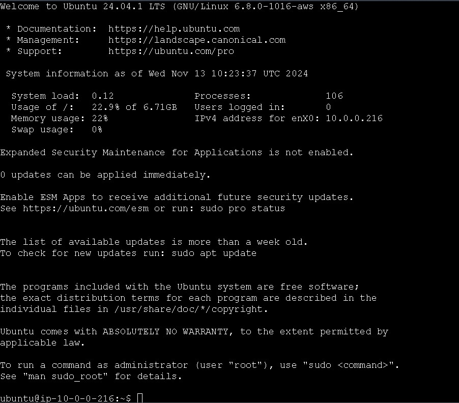
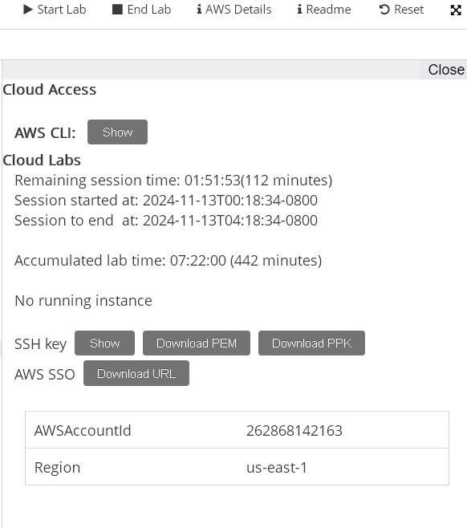
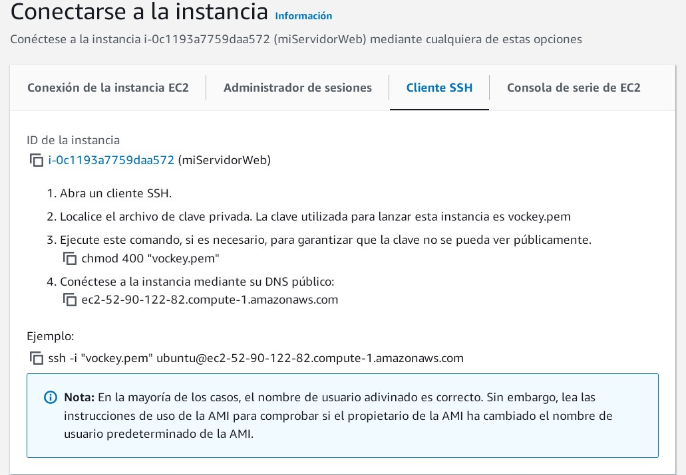
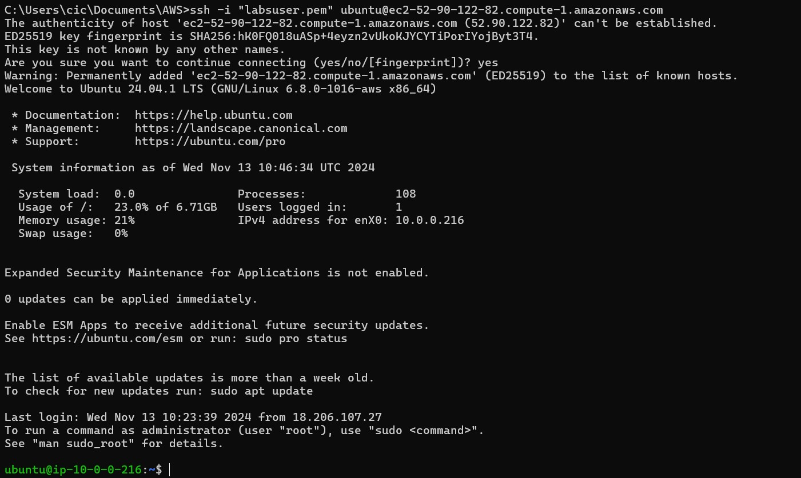

# Actividad 1: Crear VPC, grupo seguridad y EC2
En este ejercicio vamos a crear Amazon Virtual Private Cloud (VPC), un grupo de seguridad y finalmente crearemos la instancia EC2( Maquina virtual) 
- [Actividad 1: Crear VPC, grupo seguridad y EC2](#actividad-1-crear-vpc-grupo-seguridad-y-ec2)
  - [Crear una VPC](#crear-una-vpc)
    - [Características principales de una VPC:](#características-principales-de-una-vpc)
    - [Ejemplo de uso:](#ejemplo-de-uso)
  - [Crear un grupo de seguridad](#crear-un-grupo-de-seguridad)
    - [Características principales de un grupo de seguridad:](#características-principales-de-un-grupo-de-seguridad)
    - [Ejemplo de uso:](#ejemplo-de-uso-1)
  - [Crear una Máquina Virtual](#crear-una-máquina-virtual)
    - [Pasos para crear una instancia EC2:](#pasos-para-crear-una-instancia-ec2)
    - [Conectarnos a la máquina](#conectarnos-a-la-máquina)

## Crear una VPC
Una Amazon Virtual Private Cloud (VPC) es un servicio que permite lanzar recursos de AWS en una red virtual que nosotros definimos. Esta red virtual se asemeja a una red tradicional que operaría en su propio centro de datos, con los beneficios de utilizar la infraestructura escalable de AWS.
### Características principales de una VPC:
1. **Aislamiento**: Proporciona un entorno de red aislado donde podemos definir nuestro propio espacio de direcciones IP, subredes, tablas de rutas y configuraciones de puertas de enlace de red.
2. **Subredes**: Podemos crear subredes públicas y privadas dentro de la VPC para segmentar nuestros recursos.
3. **Seguridad**: Utiliza grupos de seguridad y listas de control de acceso de red (ACL) para controlar el tráfico entrante y saliente de nuestras instancias.
4. **Puertas de enlace**: Podemos configurar puertas de enlace de Internet, NAT Gateways y VPN para conectar la VPC definida a Internet y a otras redes.
5. **Escalabilidad**: Permite escalar nuestros recursos de red según sea necesario.

### Ejemplo de uso:
* **Subred pública**: Para instancias que necesitan acceso directo a Internet.
* **Subred privada**: Para instancias que no necesitan acceso directo a Internet, pero pueden acceder a través de una NAT Gateway.

En resumen, una VPC proporciona un control total sobre nuestro entorno de red en la nube, permitiéndonos definir y gestionar la infraestructura de manera segura y eficiente.

Crea una VPC con los siguientes datos:
* Nombre: lab
* CIDR: 10.0.0.0/16
* Sin bloque de CIDR IPv6
* Solo una zona de disponibilidad
* En La zona: us-east-1a
* Con una subred pública  en el  10.0.0.0/24 y una subred privada 10.0.1.0/24
* No crearemos un NAT gateways de S3
* La resolución de DNS estará activa

El resultado es:

 **VPC:** `lab-vpc`

   - **Subred**:

     - us-east-1a
       - ***Public* subred name:** `lab-subnet-public1-us-east-1a`

       - ***Private* subnet name:** `lab-subnet-private1-us-east-1a`

   - **Tablas de enrutamiento**

     - `lab-rtb-public`
     - `lab-rtb-private1-us-east-1a`

   - **conexiones a internet**

     - `lab-igw`


`lab-igw` es una *puerta de enlace de Internet* que es un recurso de VPC que permite la comunicación entre instancias EC2 en su VPC e Internet.

La subred pública `lab-subnet-public1-us-east-1a` tiene un CIDR de **10.0.0.0/24**, lo que significa que contiene todas las direcciones IP que comienzan con **10.0.0.x**. El hecho de que la tabla de rutas asociada con esta subred pública enruta el tráfico de red 0.0.0.0/0 a la puerta de enlace de Internet es lo que la convierte en una subred pública.

La subred privada `lab-subnet-private1-us-east-1a` tiene un CIDR de **10.0.1.0/24**, lo que significa que contiene todas las direcciones IP que comienzan con **10.0.1.x**.

No hemos creado un _NAT Gateway_ que es un recurso de VPC que se utiliza para proporcionar conectividad a Internet a cualquier instancia EC2 que se ejecute en subredes *privadas* en la VPC sin que esas instancias EC2 necesiten tener una conexión directa a la puerta de enlace de Internet porque es un servicio que consume muchos recursos y de momento no vamos a utilizarlo.


## Crear un grupo de seguridad
Un grupo de seguridad en AWS es un conjunto de reglas que controlan el tráfico entrante y saliente de las instancias de Amazon EC2. Actúa como un firewall virtual para sus instancias, permitiéndonos controlar el acceso a ellas.

### Características principales de un grupo de seguridad:
1. **Reglas de entrada**: Definen el tráfico que se permite entrar a las instancias asociadas.
2. **Reglas de salida**: Definen el tráfico que se permite salir de las instancias asociadas.
3. **Estado**: Las reglas de los grupos de seguridad son con estado, lo que significa que si permite una conexión entrante, la respuesta correspondiente se permite automáticamente, independientemente de las reglas de salida.
4. **Asociación**: Puede asociar uno o más grupos de seguridad a una instancia de EC2 cuando la lanza o en cualquier momento después de lanzarla.

### Ejemplo de uso:
- **Abrir el puerto 80**: Permitir el tráfico HTTP entrante.
- **Abrir el puerto 22**: Permitir el tráfico SSH entrante para administración remota.

En resumen, los grupos de seguridad nos permiten definir reglas detalladas para controlar el acceso a nuestras instancias de EC2, mejorando la seguridad de nuestra infraestructura en la nube.

Creamos un grupo de seguridad de nombre `grupo-seguridad-web`  que permita abrir el puerto 80 y el puerto 22

* Nombre: grupo-seguridad-web
* Descripcion: permitir el tráfico SSH y HTTP entrante
* VPC que pertenezca a la VPC creada Lab
* Crear las reglas de entrada de SSH y HTTP desde cualquier ip

El resultado será:


## Crear una Máquina Virtual
Crear una instancia en AWS significa lanzar una máquina virtual en la nube de Amazon Web Services (AWS) utilizando el servicio Amazon Elastic Compute Cloud (EC2). Una instancia EC2 es un servidor virtual que puede ejecutar aplicaciones y servicios como si fuera un servidor físico.

### Pasos para crear una instancia EC2:
1. **Seleccionar una AMI (Amazon Machine Image)**: Una AMI es una plantilla que contiene el sistema operativo, el servidor de aplicaciones y las aplicaciones necesarias.
2. **Elegir el tipo de instancia**: Seleccionar el tipo de instancia que determina la capacidad de cómputo, memoria y almacenamiento.
3. **Configurar los detalles de la instancia**: Especificar la red, subred, y otras configuraciones de red.
4. **Agregar almacenamiento**: Definir el tamaño y tipo de almacenamiento (por ejemplo, SSD).
5. **Agregar etiquetas**: Asignar etiquetas para organizar y gestionar las instancias.
6. **Configurar el grupo de seguridad**: Definir las reglas de firewall para controlar el tráfico entrante y saliente.
7. **Seleccionar un par de claves**: Elegir o crear un par de claves para acceder a la instancia de manera segura.

En resumen, crear una instancia EC2 en AWS implica configurar y lanzar una máquina virtual que puede ser utilizada para ejecutar aplicaciones y servicios en la nube.

Para crear la instancia nos vamos a la opción **Lanzar la instancia**

* Crear una instancia EC2 en la subred pública creada con anterioridad
* Nombre: miServidorWeb 
* seleccionamos una AMI Ubuntu server 22.04 con disco SSD nos indica que es apto para la capa gratuita
* Con un T2 micro
* Selecciona el par de claves __vockey__ (siempre para los laboratorios eligiremos estas claves)
* Cambiamos a nuestra VPC creada, elegimos en la subred pública `lab-subnet-public1-us-east-1a` 
* Habilitar la ip pública
* Que tenga el grupo de seguridad `grupo-seguridad-web`
* Agregamos un nuevo volumen con 30 gigas de disco

### Conectarnos a la máquina 
En la instancia desde la opción __Connect__ seleccionamos `conectarse mediante la Conexión de la instancia EC2 ` , como no hemos cambiado el usuario será ubuntu.
Para ello utiliza el par de claves vockey,lo acaba de inyectar para conectarnos y así podemos trabajar directamente conectados a la consola




O tenemos la opción de conectarnos desde el terminal utilizando bien WindowsPowerShell, CMD o Putty  utilizando el protocolo SSH 

La conexión a utilizar en Windows PowerShell  es __SSH cliente__
Para ver donde se encuentran las credenciales vockey, nos vamos al panel del laboratorio y vamos a la opción **AWS Detalles** 



y podemos descargar el archivo.pem para utilizar WindowsPowerShell o el archivo.PPK para Putty

Al descargar el archivo en vez de denominarlo vockey  se denomina `labsuser`. Ubicarlo dentro de alguna carpeta del usuario

```shell
ssh -i "<ruta_archivo_labsuser.pem>" ubuntu@<IP_publica>

ssh -i "<ruta_archivo_labsuser.pem>" ubuntu@<DNS>
```
Es conveniente que el archivo se encuentre en un lugar que no sea público y al ser posible que solo el usuario pueda acceder a él.  



Abrimos de nuevo una consola cmd, he utilizado una consola de git cmd y ahora nos dejará conectarnos, si eliges la opción del DNS es mejor puesto que la `ip publica` cambia cada vez que arranques la instancia, se puede configurar para que sea estática denominada en amazon ip-elástica pero nos consume recursos y realmente no hace falta. 




Si quieres conectarte utilizando Putty sigue el manual de ayuda que figura en la consola de AWS [Usuarios de Windows: Uso de SSH para conectarse](https://labs.vocareum.com/web/1265585/939488.0/ASNLIB/public/docs/lang/es-es/README.html#sshwindows)