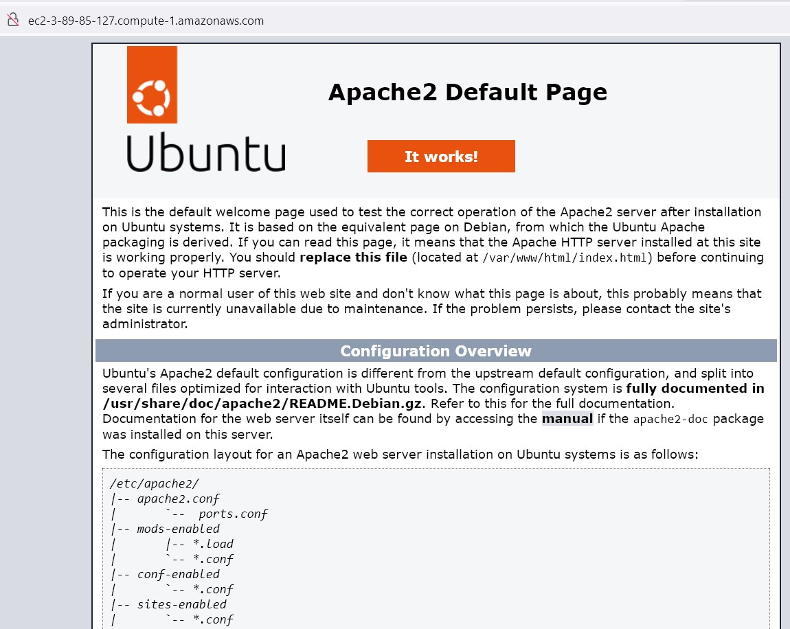
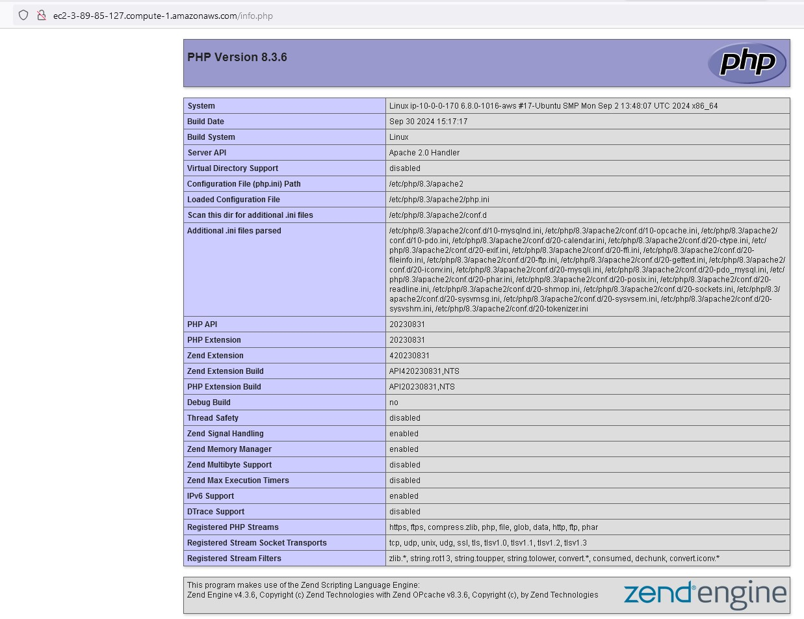

# Actividad 2: Instalación de un servidor web
Como servidor web vamos a instalar APACHE, con el lenguaje de programación PHP.
- [Actividad 2: Instalación de un servidor web](#actividad-2-instalación-de-un-servidor-web)
  - [Instalar APACHE](#instalar-apache)
    - [Instalar php como lenguaje de programación](#instalar-php-como-lenguaje-de-programación)

## Instalar APACHE
Los pasos a seguir son:
1. Comprobar que el sistema esté actualizado
```sh
apt update
```
2. Instalar apache
```sh
apt install apache2
# comprobar que arranca el servicio y se encuentra activo
systemctl status apache2
```
3. Comprobar que funciona correctamente. En cualquier navegador acceder por el `DNS` o por la `ip pública` de la instancia. Nos muestra la página web por defecto de Apache 
Ejemplo: 
http://ec2-3-89-85-127.compute-1.amazonaws.com/


4. Configuración de un host virtual. 
Un host virtual en Apache2 permite alojar múltiples sitios web en un solo servidor. Cada sitio puede tener su propio dominio y configuración. Hay dos tipos de hosts virtuales:

* **Hosts virtuales basados en nombre**: Permiten que varios dominios compartan la misma dirección IP.
* **Hosts virtuales basados en IP**: Cada dominio tiene su propia dirección IP.

Aquí tienes un ejemplo de configuración de un host virtual basado en nombre:

```apache
<VirtualHost *:80>
    ServerAdmin webmaster@ejemplo.com
    ServerName www.ejemplo.com
    ServerAlias ejemplo.com
    DocumentRoot /var/www/ejemplo.com/public_html
    ErrorLog ${APACHE_LOG_DIR}/ejemplo.com-error.log
    CustomLog ${APACHE_LOG_DIR}/ejemplo.com-access.log combined
</VirtualHost>
```

Guarda esta configuración en un archivo dentro de `/etc/apache2/sites-available/` y luego habilítalo con:

```sh
sudo a2ensite nombre_del_archivo.conf
sudo systemctl reload apache2
```
En Ubuntu tiene habilitado un bloque de servidor por defecto, que esta configurado para proporcionar documentos del directorio `/var/www/html`. Sin embargo, nosotros vamos a crear otro directorio de publicación web.

Realizamos los siguientes pasos:
```sh
# Crearemos un directorio dentro de /var/www que denominaremos miWeb
mkdir /var/www/miWeb
# permisos adecuados al directorio , por ejemplo 755 ( permitir al propietario leer, escribir y ejecutar los archivos, y solo permisos de lectura y ejecución a los grupos de terceros)
chmod -R 755 /var/www/miWeb
```
A continuación,  crear una página de ejemplo denominada `index.html` por ejemplo:
Crear una página HTML5 simple que muestre un mensaje de bienvenida a la página web "miWeb", puedes usar el siguiente código:
```html
<!DOCTYPE html>
<html lang="es">
<head>
    <meta charset="UTF-8">
    <meta name="viewport" content="width=device-width, initial-scale=1.0">
    <title>Bienvenida a miWeb</title>
</head>
<body>
    <h1>Bienvenida a la página web miWeb</h1>
</body>
</html>
```
Guarda este contenido en un archivo llamado `index.html` dentro del directorio `/var/www/miWeb`. Podemos utilizar el editor de archivos `nano`
```sh
cd /var/www/miWeb
nano index.html # copiamos el código html
```
En lugar de modificar la configuración por defecto que se encuentra en `/etc/apache2/sites-available/000-default.conf` lo copiaremos creando nuestro fichero de configuración.
* el fichero a crear tiene que tener la misma extensión `.conf`
* debemos cambiar la directiva `DocumentRoot` con nuestro directorio
```sh
cd /etc/apache2/sites-available/
cp 000-default.conf miWeb.conf
nano miWeb.conf # cambiar DocumentRoot
```
5. Podemos comprobar que no hemos cometido errores de sintaxis en el fichero de configuración creado
```sh
apache2ctl configtest
```
6. Para que la configuración realizada la tenga en cuenta el sistema requiere que sea habilitada
```sh
a2ensite miWeb.conf
```
7. Deshabilitamos el sitio por defecto
```sh
a2dissite 000-default.conf
```
8. Hay que reiniciar Apache para que tenga efecto la configuración realizada
```sh
systemctl restart apache2
# comprobar que no hay fallos
systemctl status apache
```
9. En el navegador comprobar que atiende a nuestra página
http://ec2-3-89-85-127.compute-1.amazonaws.com/


10. Ahora debemos configurar un firewall para garantizar que solo el tráfico necesario pueda llegar a su proxy inverso. Usaremos Uncomplicated Firewall (UFW) para este propósito.
```sh
# comprobamos si está ya instalado en el sistema y en que estado está
ufw status
# si hubiera que instalarlo ejecutamos el comando siguiente
apt install ufw
# ponerlo activo. !!Ojo!! antes de ponerlo activo hay que añadir las aplicaciones que queramos que filtre, para ver las aplicaciones es **ufw app list** y para añadir las aplicaciones al cortafuegos **ufw alow nombre_aplicación**
ufw app list
# daremos de alta el SSH  y el HTTP 
ufw allow OpenSSH
ufw allow  Apache 
ufw enable
# comprobamos que esta correcto
ufw status
```
Para comprobar que todo esta correcto podemos acceder de nuevo a la página web. 

### Instalar php como lenguaje de programación
Los pasos a seguir son:
1. Comprobar que el sistema esté actualizado
```sh
apt update
```
2. Instalar php 
```sh
apt install php libapache2-mod-php php-mysql

```
3. Configurar php
Para configurar este lenguaje de programación trabajaremos en primer lugar sobre el archivo de configuración del módulo del servicio web. Si has instalado la versión incluida en Ubuntu 24.04 LTS. El fichero de configuración `php.ini` se encuentra en `/etc/php/8.3/apache2/php.ini`

Minimamente deberiamos poner la zona horaria del servidor directiva `date.timezone`  y la configuración por defecto del tratamiento de errores está para un entorno de producción  si lo queremos para un entorno de desarrollo debería ser cambiada.
```sh
nano /etc/php/8.3/apache2/php.ini
# cambiar la zona horaria
date.timezone=Europe/Madrid
# errores para desarrollo
error_reporting= E_All
display_errors= On
display_startup_errors= On
# activar las extensiones de las librerias curl y zip las necesitamos posteriormente para composer
extension=curl
extension=zip
# para que los cambios se tengan en cuenta realizar
systemctl reload apache2
# comprobar que apache esta correcto
systemctl status apache2
```
4. Para comprobar PHP  creamos en una página denominada `info.php` que tendrá la siguiente información:
```php
<?php
    phpinfo();
?>
```
los pasos son:
```sh
# voy al directorio donde poner mi página
cd /var/www/miWeb
# creo mi página info.php
nano info.php #copio la información de la página
```
En el navegador vamos a llamar a la página para comprobar que todo esta correcto
Ejemplo

