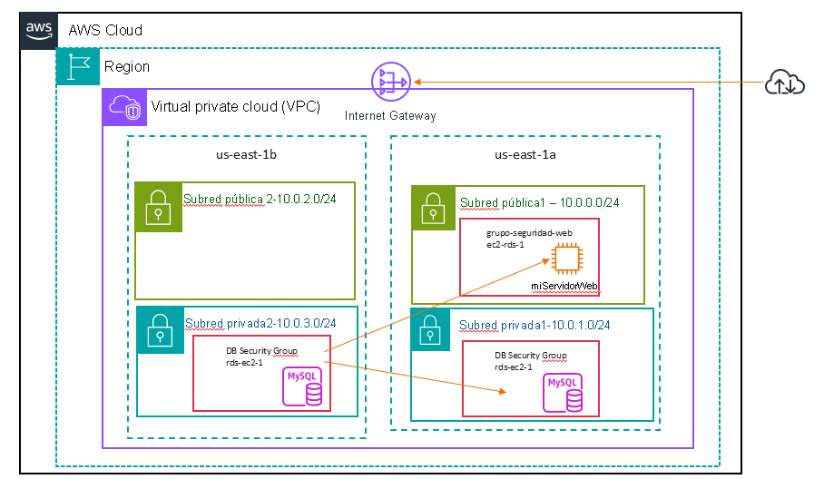
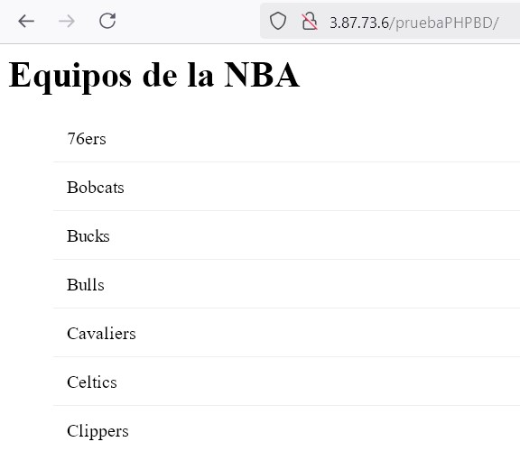

# Actividad 3 - Crear Base de Datos en RDS

En este ejercicio vamos a crear una instancia de base de datos `MySQL` administrada por AWS, conectar con la instancia EC2 creada y desplegar una aplicación web que utiliza la Base de datos.
- [Actividad 3 - Crear Base de Datos en RDS](#actividad-3---crear-base-de-datos-en-rds)
  - [Crear un grupo de seguridad para la instancia de base de datos de RDS](#crear-un-grupo-de-seguridad-para-la-instancia-de-base-de-datos-de-rds)
  - [Crear un grupo de subredes de base de datos](#crear-un-grupo-de-subredes-de-base-de-datos)
  - [Crear una instancia de base de datos de Amazon RDS](#crear-una-instancia-de-base-de-datos-de-amazon-rds)
  - [La instancia de RDS creada tenga acceso desde el exterior a traves de MySQLWorkbench](#la-instancia-de-rds-creada-tenga-acceso-desde-el-exterior-a-traves-de-mysqlworkbench)
  - [Desplegar una aplicación web en el servidor web con interación a la RDS creada](#desplegar-una-aplicación-web-en-el-servidor-web-con-interación-a-la-rds-creada)


***Amazon Relational Database Service*** (Amazon RDS) facilita las tareas de configuración, operación y escalado de una base de datos relacional en la nube. Proporciona una capacidad rentable y de tamaño modificable, al mismo tiempo que permite gestionar las tareas de administración de base de datos que requieren mucho tiempo, lo que permite centrarse en las aplicaciones y el negocio. Amazon RDS le ofrece seis motores de base de datos familiares entre los que elegir: Amazon Aurora, Oracle, Microsoft SQL Server, PostgreSQL, MySQL y MariaDB.

**Objetivos**
- Lanzar una instancia de base de datos de Amazon RDS con alta disponibilidad
- Configurar la instancia de base de datos para permitir conexiones desde su servidor web
- Configurar la instancia de base de datos para permitir conexiones externas utilizando MySQLWorkbench
- Desplegar una aplicación web en el servidor web con interación con RDS 

**Situación referente a la Base de datos**

Al final, la infraestructura de la base de datos será la siguiente:



## Crear un grupo de seguridad para la instancia de base de datos de RDS

Crearemos un grupo de seguridad para permitir que el servidor web acceda a la instancia de base de datos de RDS. El grupo de seguridad se utilizará al lanzar la instancia de base de datos.

1. En la **consola de administración de AWS**, encontraremos el menú <span id="ssb_services">Services (Servicios), <i class="fas fa-angle-down"></i></span> donde debe hacer clic en **VPC**.

2. En el panel de navegación izquierdo, haga clic en **Security Groups** (Grupos de seguridad).

3. Haga clic en <span id="ssb_orange">Create security group</span> (Crear grupo de seguridad) y, a continuación, configuramos lo siguiente:

   - **Nombre del grupo de seguridad** : `grupoSeguridadDB` 
   - **Descripción:** `Permitir el acceso a la BD`
   - **VPC:** _VPC de laboratorio creada_

   Ahora, agregaremos una regla al grupo de seguridad para permitir las solicitudes de base de datos entrantes.

4. En el panel **Reglas de entrada** , seleccione <span id="ssb_white">Agregar regla</span> 

   Actualmente, el grupo de seguridad no tiene reglas. Agregaremos una regla para permitir el acceso desde el _grupo de seguridad web_.

5. Configure los siguientes ajustes:

   - **tipo** : _MySQL/Aurora (3306)_
   - **bloques CIDR, IP, grupos de seguridad or lista de prefijos** : escriba `sg` y luego seleccione _Grupo de seguridad web_.

   Así se configura el grupo de seguridad de base de datos para permitir el tráfico entrante en el puerto 3306 desde cualquier instancia EC2 asociada al _Grupo de seguridad web_.

6. Elija <span id="ssb_orange">Crear grupo de seguridad</span> 
   Utilizará este grupo de seguridad al lanzar la base de datos de Amazon RDS.


## Crear un grupo de subredes de base de datos

Antes de realizar este paso debemos crear otra zona de disponibilidad por ejemplo en **us-east-1b** y crear una subred pública con un **10.0.2.0/24** y una subred privada **10.0.3.0/24**. Solo vamos a trabajar con la subred privada de esta nueva zona de disponibilidad.
1. En el menú <span id="ssb_services">Servicios<i class="fas fa-angle-down"></i></span>, haga clic en **VPC**.
2. En el panel de navegación izquierdo, haga clic en **Subredes**.
3. Haga clic en <span id="ssb_orange">Crear subred</span> y, a continuación, configure lo siguiente:
   - **VPC:** _VPC de laboratorio_
   - **Nombre:** `lab-subnet-private2-us-east-1b`
   - **Zona de disponibilidad:** us-east-1b
   - **Bloque CIDR:** 10.0.0.16
   - **Bloque de CIDR de la subred:**  10.0.3.0/24 

y agregamos otra subred en este caso pública, con nombre `lab-subnet-public2-us-east-1b` y 10.0.2.0/24, pero que no vamos a utilizar.

4. Nos desplazamos hacia abajo hasta la sección **Crear subred**.

Crearemos un _grupo de subredes de base de datos_ que se emplea a fin de informar a RDS acerca de qué subredes se pueden utilizar para la base de datos. Cada grupo de subredes de base de datos requiere subredes en al menos dos zonas de disponibilidad.

1. En el menú <span id="ssb_services">Servicios<i class="fas fa-angle-down"></i></span>, haga clic en **RDS**.

2. En el panel de navegación izquierdo, haga clic en **Grupos de subredes**.

   <i class="fas fa-exclamation-triangle"></i> Si el panel de navegación no está visible, haga clic en el icono del menú <i class="fas fa-bars"></i> en la esquina superior izquierda.

3. Haga clic en <span id="ssb_orange">Crear grupo de subredes de base de datos</span> y, a continuación, configure lo siguiente:

   - **Nombre:** `grupo de subredes de base de datos`
   - **Descripción:** `grupo de subredes de base de datos`
   - **VPC:** _VPC de laboratorio_

4. Nos desplazamos hacia abajo hasta la sección **Agregar subredes**.

5. Expandimos la lista de valores en **Zonas de disponibilidad** y seleccionamos las dos primeras zonas: **us-east-1a** y **us-east-1b**.

6. Expandimos la lista de valores en **Subredes** y seleccionamos las que están asociadas con los rangos de CIDR **10.0.1.0/24** y **10.0.3.0/24** que son las privadas.

   Estas subredes deberían mostrarse ahora en la tabla de **subredes seleccionadas**.

7. Hacemos clic en <span id="ssb_orange">Crear</span>

   Utilizaremos este grupo de subredes de base de datos en la creación de la base de datos que es el siguiente punto.

## Crear una instancia de base de datos de Amazon RDS

Debemos configurar y lanzar una instancia de base de datos `Multi-AZ` de Amazon RDS para `MySQL`.

Las implementaciones ***Multi-AZ*** de Amazon RDS proporcionan mejoras en la disponibilidad y la durabilidad de las instancias de base de datos, lo que las hace adecuadas para las cargas de trabajo de bases de datos de producción. Cuando aprovisiona una instancia `Multi-AZ` de base de datos, Amazon RDS crea automáticamente una instancia de base de datos principal y, de forma sincronizada, replica los datos a una instancia en espera en una zona de disponibilidad diferente.

1. En el panel de navegación de la izquierda, haga clic en **Bases de datos** .
2. Haga clic en <span id="ssb_orange">Crear base de datos</span>.
3. Elegir un método de creación de base de datos, creación estándar
4. En opciones del motor elegir **MySQL**.
5. Selecciona **Plantillas** la opción **Producción**.
6. Selecciona  **Disponibilidad y durabilidad** la opción **instancia de base de datos Multi-AZ**.
7. En **Configuración** configuramos lo siguiente:

   - **Identificador de instancias de bases de datos:** `lab-db`
   - **Nombre de usuario maestro**: `admin` 
   - **Contraseña maestra:** `lab-password`
   - **Confirmar contraseña:** `lab-password`
8. En **Configuración de la instancia** configuramos lo siguiente:

   - **Clases con ráfagas incluye clases t** .
   - Selecciona _db.t3.micro_
9. En **Almacenamiento**, configuramos lo siguiente:
    
    - **Tipo de almacenamiento**: _SSD de uso general (gp3)_
    - **Almacenamiento asignado:** _20_
10. En **Conectividad**, configuramos lo siguiente:
Opciones posibles:
    - **Conectarse a un recurso informático de EC2**
    - **Instancia EC2** _miServidorWeb_
Otra opción:
    - **Nube privada virtual (VPC):** _Lab VPC_
1.  En **Grupos de subredes de la base de datos**, en la lista desplegable:
   - Elegir _grupos de seguridad de base de datos_.
    
2.  En **Acceso público** , vamos a ponerlo `si`:
   Normalmente esta propiedad estara a no pero para permitir que nos conectemos desde fuera a la BD con el MySQLWorkbench lo vamos a poner público. Puede que no nos permita en ponerlo público si la VPC no tiene activado la generación de DNS host. Es una acción que permite ser modificada posteriormente.
3.  En **grupo de seguridad VPC firewall** vamos a crear uno nuevo para permitir la conexión exterior nombre `grupo acceso exterior bd`
4.  En **Configuración adicional** configuramos lo siguiente:
    
    - **Nombre de base de datos inicial**: `lab`
    - Desactivar **Habilitar copias de seguridad automáticas**
    - Desactivar **Habilitar el cifrado**.
    - Desactivar **Habilitar actualización automática de versiones secundarias** .

   <i class="fas fa-comment"></i> Esto desactivará las copias de seguridad, lo que no suele recomendarse, pero permitirá una implementación más rápida de la base de datos para este ejercicio.
   
5.  Haga clic en <span id="ssb_orange">Crear base de datos</span>
   Ahora se lanzará  el scrip de creación de la base de datos.
6.  Haga clic en **lab-db** (haga clic en el propio enlace).

   Esperar **aproximadamente 4 minutos** para que se habilite la disponibilidad de la base de datos. El proceso de implementación implica la implementación de una base de datos en dos zonas de disponibilidad diferentes.
7.  Esperar hasta que **Información** cambie de **Modificando** a **Disponible**.

Si la BD no ha permitido ponerlo público debemos ir al servicio **VPC**, seleccionar nuestra vpc denominada `lab`  a la opción `acciones`  **editar la configuración de la VPC**  y habilitar nombres de host DNS.
A continuación, ir al servicio de base de datos **RDS**, selecciona la bd creada denominada `lab-db` y a la opción `modificar` y nos permite modificar y poner **accesible públicamente** a `si`.  

## La instancia de RDS creada tenga acceso desde el exterior a traves de MySQLWorkbench

Esto no es habitual porque como hemos visto la base de datos ha sido creada en las redes privadas, es decir, sin acceso desde el exterior.
Un paso que hemos realizado anteriormente es crear la base de datos con **acceso público**  y ahora tendremos que abrir el paso de acceso a través de internet.
y hemos añadido un nuevo grupo de seguridad  `grupo acceso exterior bd`

Al grupo de seguridad creado añadimos una nueva regla de entrada para que permita la conexión desde cualquier ip por el puerto 3306. Otra opción más segura es crear un *NAT Gateway* o también solo habilitar que la conexión sea desde tú ip.

1. En la **consola de administración de AWS**, encontraremos el menú <span id="ssb_services">Servicios, <i class="fas fa-angle-down"></i></span> donde debe hacer clic en **VPC**.

2. En el panel de navegación izquierdo, haga clic en **Grupos de seguridad**.

3. Haga clic en <span id="ssb_orange"> seleccionar el grupo acceso exterior bd</span>  y, a continuación, configure lo siguiente:
4. En el panel **Reglas de entrada**, seleccione <span id="ssb_white">Editar reglas de entrada</span>  y modificamos la regla para permitir desde cualquier IP con los datos que figuran a continuación.
5. Configurar el siguiente ajuste:

   - **Anywhere-ipV4**
   
Ahora al grupo de subredes creado tendremos que configurar que cada una de las subredes asignarlas en la Tabla de rutas asignar el **igw-xxxxx** para acceso a internet

1. En el menú <span id="ssb_services">Servicios<i class="fas fa-angle-down"></i></span>, haga clic en **RDS**.
   
2. En el panel de navegación izquierdo, haga clic en **Grupos de subredes**.
   
3. Seleccina el grupo de subredes creado  `grupo de subredes de base de datos`  y por cada una de las subredes asociadas ver el enrutador asociado (tablas de enrutamiento). 
   
4. Al enrutador **rtb-xxxx** asociar asociarle **lab-igw**, la puerta de enlace de internet.
   
5.  Una vez tengamos configurado el enrutador con la puerta de enlace de internet podemos configurar el acceso desde MySQLWorkbench. Los datos que necesitamos de la RDS creada son:
    - **Punto de enlace & puerto**, lo encontramos una vez seleccionada la base de datos en el apartado `conectividad & seguridad`
    - **Nombre del usuario maestro**, lo entcontramos una vez seleccionada la base de datos en el apartado `Configuracion` y la password dada a la base de datos 
6.  Configuramos la conexión en MySQLWorkBench:
    - **Hostname**, ponemos el valor de `punto de enlace` de la base de datos
    - **port**, ponemos  el valor de `puerto` de la base de datos
    - **Username**, ponemos el valor de `nombre del usuario maestro` de la base de datos
    - **Password**, ponemos el valor de la password dada en el creación de la base de datos
7.  Probamos la conexión  y creamos el esquema de base de datos que necesitamos para realizar el despliegue de la aplicación

## Desplegar una aplicación web en el servidor web con interación a la RDS creada

1. Primero tendremos que conectarnos a traves de ssh con el servidor web que reside en la instancia EC2 creada. Realizar las siguientes comprobaciones:
   -  Tenemos instalado un servidor apache y hemos creado un virtual host que apunta a un directorio donde desplegar la web
   -  Tenemos instalado php de versión 8.* 
2. Lo siguiente es subir al directorio de despliegue web la aplicación php desarrollada. Una forma es utilizando el [comando scp](https://desarrolloweb.com/articulos/transferir-archivos-scp-ssh.html)
   - Lo mejor es subir un archivo.zip.  Es posible que tengas que instalar en el servidor la aplicación zip y unzip
```sh
scp -i "labsuser.pem" pruebaPHPBD.zip ubuntu@ec2-34-207-226-176.compute-1.amazonaws.com:/var/www/miWeb
# instalar zip y unzip
apt install zip
# descomprimir
unzip pruebaPHPBD.zip
```
los dos siguientes pasos solo son necesarios si la aplicación utiliza composer para la carga de librerias externas:
   a. Tendremos que instalar composer en el servidor. Un artículo de ayuda es https://www.ionos.es/digitalguide/servidores/configuracion/instalar-php-composer-en-ubuntu-2204/
```sh
apt install curl php-mbstring git
# instalar composer
curl -sS https://getcomposer.org/installer | sudo php -- --install-dir=/usr/local/bin --filename=composer
composer
```
  b. Realizar los cambios en el fichero .env  y es posible en la configuración del virtual host para que el directorio de despliegue coincida con nuestra estructura de carpetas.

Como esta aplicación no utiliza composer en vez de cambiar el fichero .env , debemos cambiar en el fichero `conexionBD.php` el host, usuario y password de la base de datos que se encuentra dentro del directorio Clases.
también tienes que ejecutar el script  de base de datos `dwes_01_nba.sql` que se encuentra dentro del archivo zip  `pruebaPHPBD`
   
1. Conectar la BD con la instancia EC2. En **RDS** seleccionamos la base de datos `lab-db`  y en el botón **Acciones** tenemos la acción `Configurar conexión de EC2`  si no lo hemos realizado con anterioridad, seleccionamos nuestra instancia _miServidorWeb_ y se crean los grupos de seguridad **rds-ec2-1**  y **ec2-rds-1** que abren las conexiones entre la RDS y la instancia.
2. Estamos en condiciones de probar la conexión y el funcionamiento de la web

Ejemplo
