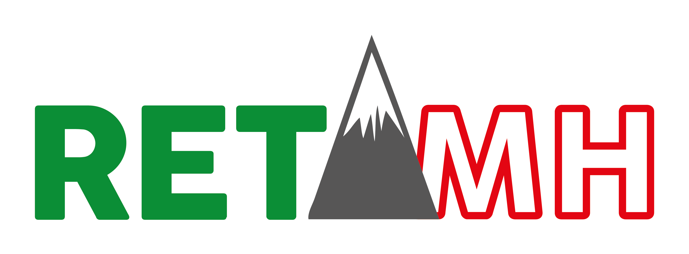

En este seminario, exploraremos los servicios más utilizados de Amazon Web Services (AWS), como VPC, grupos de seguridad, EC2, RDS, entre otros.

## Indice 🚀

**1. Actividad 1. Crear VPC, grupo seguridad y EC2.**
[Actividad 1.](AWS/actividad1.md)

**2. Actividad 2. Instalación de un servidor web**
[Actividad 2.](AWS/actividad2.md)

**3. Actividad 3. Crear Base de Datos en RDS**
[Actividad 3.](AWS/actividad3.md)

[zip de la aplicación](AWS/pruebaPHPBD.zip)